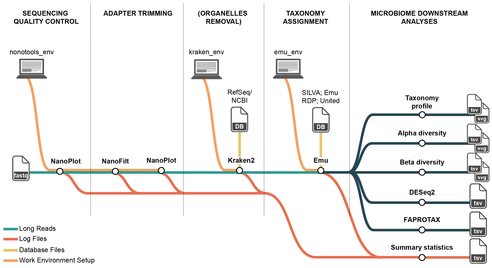

# Emu Microbiome HPC — Snakemake Pipeline

This repository includes a Snakemake pipeline that adapts the Bio-protocol’s steps using the provided scripts and Conda environments.

## Quick Start

- Ensure Conda is available and Snakemake is installed (e.g., in a base env).
- Edit paths and parameters in emu_pipeline/config.yaml.
- Place raw ONT FASTQs in emu_pipeline/raw_data (e.g., sample.fastq.gz).

### Dry-run

```bash
snakemake -n -s emu_pipeline/Snakefile
```

### Run with Conda envs

```bash
snakemake --use-conda -s emu_pipeline/Snakefile -j 8
```

## What It Does

- NanoPlot QC on raw reads → NanoFilt filter → NanoPlot QC on filtered reads → QC summary CSV/PDF.
- Kraken2 classify against organelle DB → keep only unclassified reads → summary of organelle contamination.
- EMU abundance profiling per sample with `EMU_DATABASE_DIR`.
- Optional: convert EMU taxonomy to FAPROTAX TSV and reconstruct counts from relative abundances.

## Key Config Items

- Paths: raw_dir, filtered_dir, qc_reports_dir, qc_summary_dir, no_organelle_dir, kraken_db_dir, emu_results_dir, emu_db_dir.
- NanoFilt: min_len, max_len, min_qual.
- Kraken2: kraken_confidence, kraken_threads.
- EMU: emu_keep_counts, emu_keep_read_assignments, emu_threads.
- Optional downstream: summary_counts_tsv, relative_abundance_tsv, emu_taxonomy_tsv.

## Notes

- The Kraken2 DB build can be performed externally; point kraken_db_dir to the built DB.
- EMU outputs are written per sample under emu_pipeline/emu_results.
- Downstream rules run only if the respective inputs are provided in config.

# High-fidelity microbiome profiling in soil and plants using a reproducible EMU workflow based on HPC environment

Accurately profiling soil and root-associated bacterial communities generates vast volumes of sequencing data that can overwhelm standard desktop computers. This protocol harnesses powerful high-performance computing clusters to process millions of full-length ribosomal ribonucleic acid gene reads, ensuring rapid quality filtering, organelle removal, and exact sequence matching. By providing user-friendly command-line scripts and automated workflows, it lowers the barrier to handling massive datasets, minimizes errors in data processing, and enables transparent, reproducible analyses. Researchers can make confident decisions based on robust community profiles of soil and plant-associated bacteria, accelerating insights into soil health, plant growth promotion, and sustainable agricultural practices.

### How it works

Before launching into the four protocols outlined above, users should take time to organize their computational environment, define key parameters, and map out the overall workflow. The diagram in Figure 1 provides a high‐level flowchart of the EMU pipeline from raw Nanopore FASTQ files through quality control, organelle filtering, exact‐matching taxonomic assignment, and downstream ecological analyses. Below we summarize the main considerations and options that will ensure a smooth, reproducible execution of the protocol.



#### Project directory layout (recommended)

```text
/$USER/scratch/emu_pipeline/
├── raw_data/
├── nanoplot_reports/
├── nanofilt_reports/
├── nanoplot_after_nanofilt_data/
├── qc_summary_reports/
├── filtered_data/
├── kraken2_db/
├── no_organelle_filtered_data/
├── emu_db/
├── emu_results/
├── downstream_analysis/
└── scripts/
```

### Full protocol

All steps, parameters, and troubleshooting notes are described in the published protocol.
If you use this protocol for your analysis, please cite it using the following [doi: xxxxxxx](https://www.biorxiv.org/content/10.1101/2024.11.12.623179v1)


