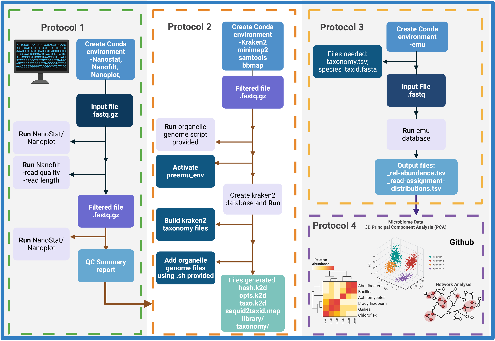

# High-fidelity microbiome profiling in soil and plants using a reproducible EMU workflow based on HPC environment

Accurately profiling soil and root-associated bacterial communities generates vast volumes of sequencing data that can overwhelm standard desktop computers. This protocol harnesses powerful high-performance computing clusters to process millions of full-length ribosomal ribonucleic acid gene reads, ensuring rapid quality filtering, organelle removal, and exact sequence matching. By providing user-friendly command-line scripts and automated workflows, it lowers the barrier to handling massive datasets, minimizes errors in data processing, and enables transparent, reproducible analyses. Researchers can make confident decisions based on robust community profiles of soil and plant-associated bacteria, accelerating insights into soil health, plant growth promotion, and sustainable agricultural practices.

### How it works

Before launching into the four protocols outlined above, users should take time to organize their computational environment, define key parameters, and map out the overall workflow. The diagram in Figure 1 provides a high‐level flowchart of the EMU pipeline from raw Nanopore FASTQ files through quality control, organelle filtering, exact‐matching taxonomic assignment, and downstream ecological analyses. Below we summarize the main considerations and options that will ensure a smooth, reproducible execution of the protocol.



### 1. Experimental design and parameter selection

(i)	Sample throughput and depth: Estimate the total number of samples and expected read yield per sample. This informs the choice of minimum quality (e.g., Q≥10) and length thresholds (e.g., ≥1,8 kb) in Protocol 1 and helps size SLURM array jobs in Protocols 2 and 3.
    
(ii)	Contamination sensitivity: Decide whether to include more permissive Kraken2 confidence levels (e.g., 0.5-0.7) when filtering chloroplast/mitochondrial reads in Protocol 2, balancing false positives against retaining genuine bacterial sequences.
    
(iii)	Taxonomic resolution: If species‐level assignments are critical, ensure the EMU reference database is up‐to‐date. Users may optionally rebuild a custom EMU database following the instructions in Protocol 3.

### 2. Workflow modularity

(i)	Modular steps: Each Basic Protocol can be run independently, allowing users to pause between stages for example, reviewing NanoPlot reports before proceeding to organelle filtering.
    
(ii)	Checkpoint files: At the end of each stage, organize outputs into versioned directories (e.g., raw_qc/, filtered_reads/, kraken_reports/, emu_outputs/) so that rerunning or parameter tweaking can target a single module without reprocessing upstream data.
    
(iii)	Visualization checkpoints: After Basic Protocol 1 and Protocol 2, inspect QC summaries and contamination tables to confirm expected improvements before committing large HPC runs in Protocol 3.

### 3. HPC Organization and resource allocation
        
(i) Directory structure. On the cluster, create a project root on scratch for I/O-heavy work or on the project share for long-term storage. Either make it manually or (recommended) clone the template from the GitHub repository.

#### Project directory layout (optional)

```text
/$USER/scratch/emu_pipeline/
├── raw_data/
├── nanoplot_reports/
├── nanofilt_reports/
├── nanoplot_after_nanofilt_data/
├── qc_summary_reports/
├── filtered_data/
├── kraken2_db/
├── no_organelle_filtered_data/
├── emu_db/
├── emu_results/
├── downstream_analysis/
└── scripts/
```

(ii)	Conda environments: Maintain separate environments, nanotools_env, preemu_env, emu_env to avoid software conflicts. Load environments via SLURM scripts at the start of each job.

(iii)	SLURM array jobs: Leverage array indexing (--array=1–N) to parallelize per‐sample steps. Specify memory (--mem=4G–24G) and CPU cores (--cpus-per-task=1–8) based on per‐step requirements: light for NanoPlot, heavier for EMU.
    
(iv)	Logging and provenance: Include module list, conda list, and invocation commands at the top of each SLURM script to capture the software stack for reproducibility.

### Full protocol

All steps, parameters, and troubleshooting notes are described in the published protocol.
If you use this protocol for your analysis, please cite it using the following [doi: xxxxxxx](https://www.biorxiv.org/content/10.1101/2024.11.12.623179v1)


